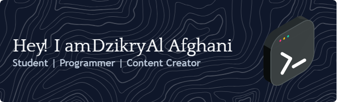

---

### 👨‍💻 Tentang Gue
Gue adalah siswa SMK jurusan PPLG yang lagi serius menekuni dunia pemrograman.  
Mulai belajar dari HP pakai Acode, Sololearn, dan YouTube — sekarang lagi ngembangin skill jadi fullstack dev step-by-step.  

> *Gue percaya, keterbatasan alat bukan penghalang buat berkembang.*

---

### 🧠 Saat Ini Gue Lagi Belajar:
- HTML, CSS, & JavaScript Dasar

- Python Dasar

- Git & GitHub (versi lokal dan remote)
- Project Kecil (kalkulator, to-do app)

---

### ⚙️ Tools yang Gue Gunain:
- 💻 Acode (HP)
- 🧠 Sololearn & W3Schools
- 📓 VS Code (Laptop)
- 🐙 GitHub (buat commit dan simpen project)

---

### 📚 Produk Digital Gue
Gue juga jual eBook produktivitas buat pelajar yang pengen berkembang:
➡️ [365 Hari Upgrade Diri - Revisi Edition](https://lynk.id/ghanzyy)

---

### 📈 GitHub Stats

  

---

### 📲 Follow & Connect with Me!
- TikTok: [@dzikry.codes](https://tiktok.com/@dzikry.codes)
- Instagram: [@dzikry.codes](https://instagram.com/dzikry.codes)
- Email: dzikry.dev@gmail.com

---

> _Coding bukan tentang alat yang mahal, tapi konsistensi dan kemauan belajar tanpa alasan._

<!--
**Dzikryalafghani/DzikryAlAfghani** is a ✨ _special_ ✨ repository because its `README.md` (this file) appears on your GitHub profile.

Here are some ideas to get you started:

- 🔭 I’m currently working on ...
- 🌱 I’m currently learning ...
- 👯 I’m looking to collaborate on ...
- 🤔 I’m looking for help with ...
- 💬 Ask me about ...
- 📫 How to reach me: ...
- 😄 Pronouns: ..
- ⚡ Fun fact: ...
-->
